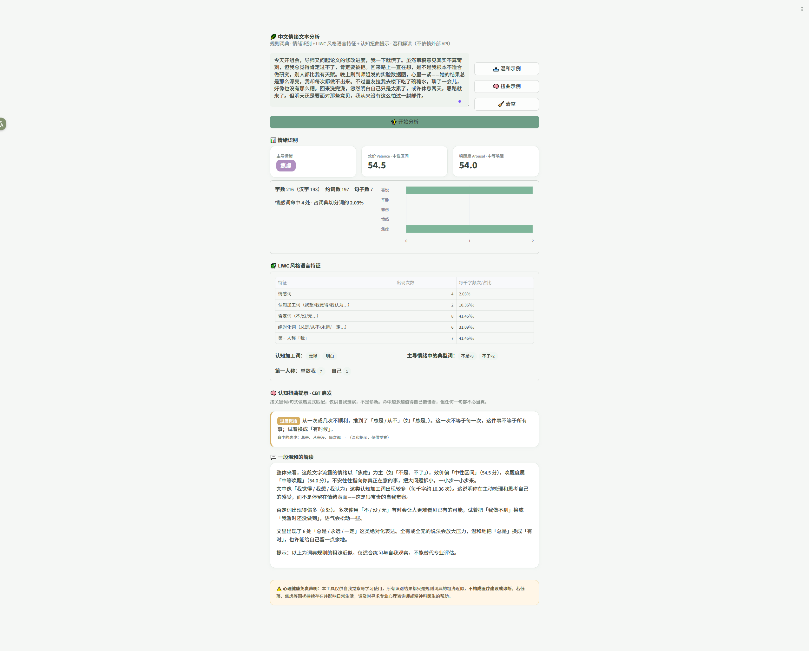

# 情绪镜 Mood Mirror 🌿

> 面向自我觉察的中文情绪文本分析工具。粘贴一段心情文字，从「情绪—语言—认知」三层拆解它。

**这是一个规则驱动的分析工具，不是大模型套壳**：全流程不调用任何外部 API / LLM，每个指标都来自可检查的词典与规则，可解释、可复现、可离线运行。它源自我对抑郁人群语言特征的学术研究——把论文里的文本分析方法，做成了人人可用的网页工具。

**🟢 在线体验**：<https://mood-mirror-pbjvot7hzmap25sfnanvyf.streamlit.app/>



---

## 功能

**① 情绪识别**

- 输出主导情绪（喜悦 / 悲伤 / 愤怒 / 焦虑 / 平静 / 中性）与各类情绪词命中明细；
- 基于情绪环状模型（circumplex model）的情绪归类，输出**三色情绪构成条**（消极 / 中性 / 积极），条宽按各类情绪词的**强度占比**分配。混合情绪会各占一段，可直接看出消极与积极各占多少，而不是被折成一个平均后的中性结论。**不输出数值型效价/唤醒度分值**：底层基准点为手工设定且强度权重会被约掉，未经标定（详见「已知限制」）。

**② LIWC 风格语言特征**（每千字频次）

- 情感词占比、认知加工词（我想 / 觉得 / 意识到…）、否定词、**绝对化词**（总是 / 从不 / 每次…）、第一人称「我」频次——均为抑郁语言研究中的经典指标。

**③ 认知扭曲提示（CBT 启发）**

- 基于启发式模式匹配识别六类常见认知扭曲：灾难化、非黑即白、过度概括、读心术、应该陈述、情绪化推理；
- 每命中一类，给出一句**温和、非评判**的重构提示（如「试着把『我应该』改成『我希望』」）。

**④ 文字解读**：规则模板生成的综合解读，语气刻意保持非评判。

**⑤ 心理健康免责声明**：本工具仅供自我觉察，不构成医疗建议；如持续感到困扰，请寻求专业帮助。

---

## 方法

### 情绪词典：大连理工情感词汇本体（DUTIR）

支持加载 DUTIR《情感词汇本体》原生格式 CSV（约 2.7 万词，7 大类 21 小类，启动时自动读取 `dutir.csv`），并完成**情绪模型归并**：

| DUTIR 小类                      | 归并到 | DUTIR 小类              | 归并到       |
| ----------------------------- | --- | --------------------- | --------- |
| PA 快乐 / PB 喜爱 / PH 赞扬 / PK 祝愿 | 喜悦  | NI 慌 / NC 恐惧 / NG 羞   | 焦虑        |
| PE 安心                         | 平静  | NE 烦闷 / NK 妒忌 / NL 怀疑 | 焦虑        |
| NB 悲伤 / NJ 失望 / NH 疚 / PF 思   | 悲伤  | ND 憎恶 / NN 贬责         | 愤怒        |
| PD 尊敬 / PG 相信                 | 喜悦  | PC 惊奇                 | 忽略（六类无对应） |

实现细节：

- 强度 1/3/5/7/9 折算至 1–5；
- 一词多义时**优先取词义序号 = 1 的基本义**（如「开心」兼有 PA快乐 与 NN贬责 两义，取前者）；
- 维护**误收词剔除表**（肯定 / 一定 / 其实…）：这些词在 DUTIR 中标为情绪，但在日常句子里多为情态副词，直接计分会虚增情绪得分；
- 找不到 CSV 时回退到内置精简词典，保证开箱即用。**内置词典共358 词**（喜悦 74 / 悲伤 96 / 愤怒 73 / 焦虑 77 / 平静 51），覆盖日常口语与常见消极表达；在线部署因不携带学术语料文件，走的即此词典。

### 否定域处理

情绪词前一小段（本子句内，最多回看 5 词）出现否定词时**不计入该情绪**（「不可能成功」里的「成功」不算积极）；标点与转折词（但 / 不过 / 然而…）视为子句边界，否定域不跨过它。

### 认知加工 / 否定 / 绝对化 / 第一人称

自建 LIWC 风格词典，直接在文本上做匹配。其中否定词只保留高区分度的「不 / 没」类（刻意排除「非 / 未 / 别」，避免「非常 / 未来 / 别人」大面积误报），与情绪判定用的完整否定集分离。

### 分词

字符级最长匹配（纯词典实现，不依赖 jieba），中文按词典切分、非中文片段整段处理。

---

## 快速开始

```bash
pip install streamlit pandas
streamlit run 20260902_app.py
```

（Windows 下也可直接双击 `启动.bat`。）

词典：启动时自动读取同目录 `dutir.csv`（或 `情绪词典.csv`）；没有则使用内置词典。也支持自建简表（表头：词语, 类别, 强度, 极性）。

---

## 已知限制

诚实说明本工具的近似性，它面向**自我觉察**而非临床诊断：

1. **分词为近似值**：未使用专业分词器（jieba），词数与占比基于词典最长匹配，仅作相对参照；
2. **情绪构成条是相对构成，不是测量分数**：条宽由情绪词的强度占比归一化而来，呈现的是「这段文字里各类情绪各占多少」，便于一眼看清混合情绪的比例。本工具**刻意不输出任何数值型效价（valence）/ 唤醒度（arousal）分值**——曾尝试计算，但六个类别基准点为手工常数、未经量表标定，且情绪强度在加权平均中会被约掉（单情绪下分子分母同时含强度，「有点难过」与「我要死了」会得到相同结果），故已移除该计算。若需有实证依据的效价/唤醒度，须接入 CAWS 等带逐词语价-唤醒度评分的词库；
3. **三色分组是简化归并**：六类情绪被归并为消极（悲伤/愤怒/焦虑）、中性（平静）、积极（喜悦）三档，各档内部的情绪差异不再体现；平静虽在概念上偏正向，在构成条中归入中性档。无情绪词命中时整条视为中性。
4. **否定词刻意收窄**：LIWC 计数只保留「不 / 没」，情绪判定用完整否定集，两套口径分开维护；
5. **情绪类别可能大面积为 0**：轻度积极 / 消极表达（「没有那么糟」）可能达不到触发强度，属词典覆盖度问题；
6. **认知扭曲只做有无命中**：启发式子串匹配，不追求召回率，提示语不构成临床判断；
7. **在线版词典覆盖面小于本地版**：出于学术语料不随仓库分发的考虑，在线部署不包含 `dutir.csv`（约 2.7 万词），仅使用 358 词的内置词典。因此线上版本对生僻或高度口语化的表达可能识别不出（表现为情绪偏向中性）；如需完整词典，请在本地放入 `dutir.csv` 运行。

做正式 LIWC 风格研究时，请换用权威分词器与完整词典（如 SC-LIWC，需授权）。

---

## 路线图

- [ ] 接入 CAWS 中国情绪词库的效价 / 唤醒度 / 优势度逐词评分——**这是让效价/唤醒度重新具备实证依据的前提**（当前版本已移除该指标，等有标定词库后再以可靠方式引入）
- [ ] 接入 SUBTLEX-CH 词频计算用词独特度（低频词占比 / 相对基准的加权偏离度）——已确认该语料库对当前情绪词典覆盖率约 33.9%，待设计指标口径
- [ ] 接入 SUBTLEX-CH 词频，计算低频词占比（认知负荷指标）
- [ ] 分句级效价曲线（处理「前负后正」类文本）
- [ ] jieba / 权威分词器支持
- [ ] 多语言（粤语繁体输入支持）

---

## 免责声明

本工具基于规则词典，仅供自我觉察与语言风格探索，**不构成任何医疗建议或心理诊断**。如果您正经历持续的情绪困扰，请及时寻求专业心理帮助。

---

*作者：Oolong0903*
